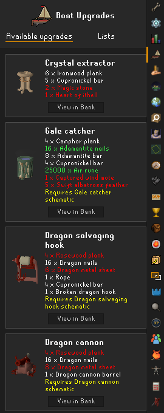
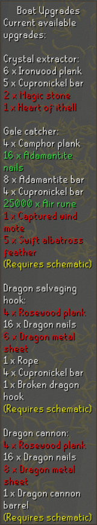
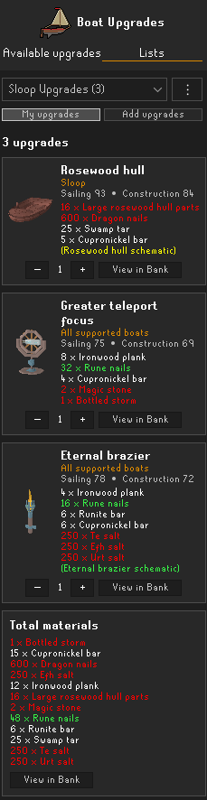
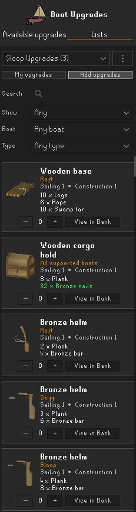
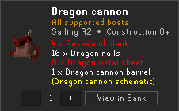
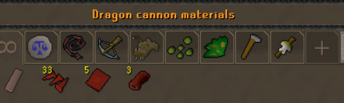
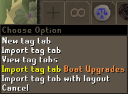
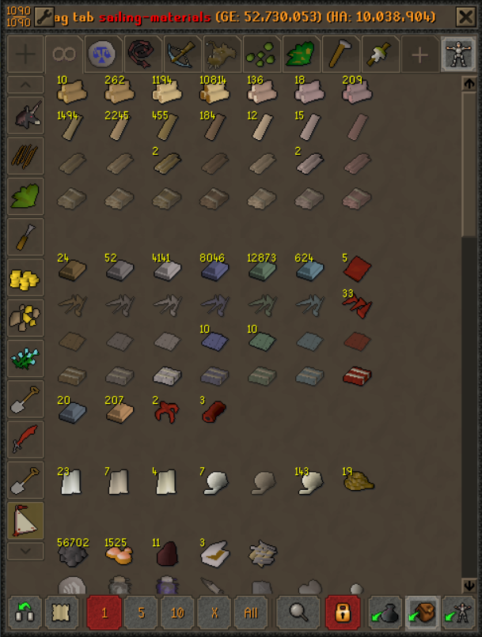
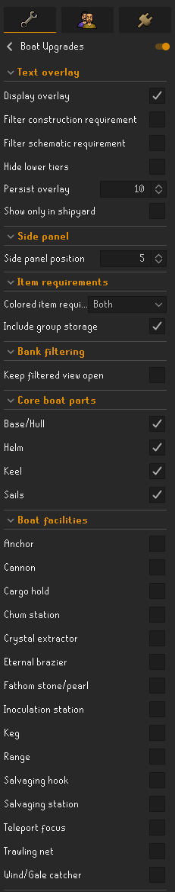

# Boat Upgrades

Boat Upgrades is a RuneLite plugin for planning and collecting every upgrade for your Sailing boats. It tracks the upgrades currently available to your character, provides a complete searchable catalog, lets you maintain multiple upgrade lists, checks the materials you own, and integrates with your bank.

## See your available upgrades

Board a boat or enter the shipyard to update your available upgrades. The plugin can show them in a dedicated side panel and in a compact in-game text overlay, including:

- The boat and upgrade type.
- Sailing and Construction level requirements.
- Every required material and quantity.
- Required schematics and whether they have been unlocked.
- Direct OSRS Wiki links from upgrade, material, and schematic names in the side panel.

The overlay can be filtered by Construction level, schematic ownership, upgrade tier, and individual boat parts or facilities. It can also remain visible for a configurable period after leaving your boat or shipyard.

| Available Upgrades side panel | In-game text overlay |
|---|---|
|  |  |

## Plan upgrades with multiple lists

The **Lists** tab is a persistent upgrade planner. Create as many named lists as you need, switch the active list from the dropdown, and use the management menu to rename, delete, import, or export a list. Exported lists are copied to your clipboard so they can be backed up or shared, while imported data is validated before it is added.

Each list:

- Keeps upgrades in the order they were added.
- Supports up to 10 copies of the same upgrade in one compact card.
- Displays the exact requirements for the selected boat variant.
- Shows required schematics beneath the material list.
- Totals matching materials across every selected upgrade.
- Remains saved to the current RuneLite profile until you remove it.

## Browse the upgrade catalog

The catalog contains every supported upgrade - not only the ones currently available to your character. Search upgrade names, types, materials, and schematics, then combine that search with filters for availability, boat size, and upgrade type. Already selected upgrades remain visible with an **Added** state, and additions always go to the currently active list.

## Track the materials you own

Material requirements can be colored everywhere they appear in the side panel and/or text overlay:

- **Green:** the full quantity is in your inventory.
- **White:** the full quantity is available across your inventory and observed storage.
- **Red:** the material is confirmed to be insufficient.
- **Gray:** ownership is unavailable, such as while logged out or before storage has been observed.

The plugin remembers the most recently observed bank contents for each RuneScape profile. Group Ironman storage can optionally be included after it has been observed. Hovering a material in the side panel shows the total owned quantity and which enabled sources were counted.

Schematic requirements use green when unlocked, yellow when still locked, and neutral gray while logged out.

## View an upgrade's materials directly in your bank

When the bank is open and RuneLite's **Bank Tags** plugin is enabled, every upgrade card has a **View in Bank** button. The same action is available on a list's aggregated **Total materials** card.

Clicking it opens a temporary material view for that upgrade or list. Items and bank placeholders remain usable, while missing materials receive temporary visual placeholders with quantity tooltips. Closing the bank exits the temporary view. Toggling on "Keep filtered view open" in the plugin settings will retain the material view when closing the bank.

| Choose **View in Bank** | Filtered material view                                                            |
|---|-----------------------------------------------------------------------------------|
|  |  |

## Import a Sailing materials bank tag

Boat Upgrades can also create a permanent, editable Bank Tags layout containing all 87 supported upgrade materials.

With the bank open, right-click the Bank Tags new-tab button and choose **Import tag tab Boat Upgrades**. The plugin creates a `sailing-materials` tab organized into eight-column sections for logs, planks, hull parts, metals, nails, keel parts, textiles, facility components, and other specialist materials. Intentional blank rows keep each group easy to scan.

Existing item tags are preserved. Importing again creates a numbered copy rather than replacing an existing tag, and missing items use Bank Tags' normal layout placeholders.

| Import the tag tab                                                                | Use the organized Sailing materials layout |
|-----------------------------------------------------------------------------------|---|
|  |  |

## Configurable settings

Settings let you choose where ownership colors appear, whether Group Ironman storage is counted, how long the overlay persists, where the side panel sits, which eligibility filters apply, whether to retain material views, and exactly which boat parts and facilities are shown in the overlay.

## Bank Tags integration

Bank features are optional. The rest of Boat Upgrades continues to work when Bank Tags is disabled; **View in Bank** actions simply remain unavailable, and the permanent Sailing materials tab is only offered while Bank Tags is active.
